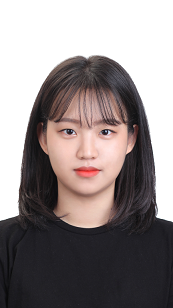

# resume
---
   

기본정보/Basic information
---

이름: 김한빈   
전공:미래융합스쿨/ICT융합전공   
Email:h20206609@glab.hallym.ac.kr
지원부문: IOT engineer   

핵심가치/Core Value
---
신뢰, 책임감 , 도전정신, 의사소통 능력   

관심분야/Feild of Interest
---
* 스마트팜 IOT 센서기능
* IOT 기술 보안
* 마케팅 직무   

소개/About me :)
---
IOT 기술로 스마트팜을 발전시키는 엔지니어 김한빈입니다.
센서의 작동기술을 주로 작업할수 있고 기술적인 보안을 담당할수 있습니다
또한 다양한 분야에서도 직무를 수행할수 있으며 마케팅분야에도 큰 관심을 두고 있습니다.   

취미관련/Hobby ;)
---
* 계절 스포츠 , 스키 또는 보딩
* 다양한 분야의 독서   

기타정보/More information
---

한림대학교 미래융합스쿨/ ICT융합전공 졸업
